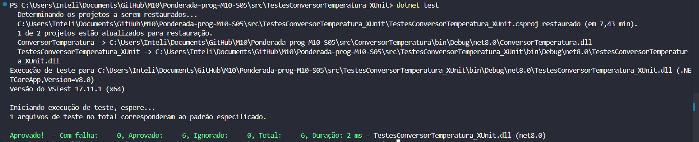
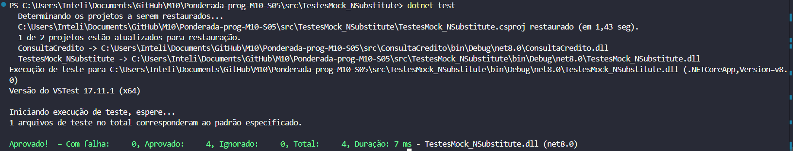

# Relatório de Testes Automatizados: Garantia de Funcionalidades

Esta documentação apresenta os detalhes sobre a validação de funcionalidades essenciais da aplicação de cálculo de juros compostos e conversão de temperaturas. A implementação de testes automatizados incluiu testes unitários, mocks e integração, visando garantir o funcionamento correto em diversos cenários de uso e a interação eficaz entre os componentes do sistema.

## Configuração do Ambiente

As ferramentas e bibliotecas utilizadas para a configuração do ambiente de testes são as seguintes:

- .NET Core SDK para desenvolvimento da aplicação principal.
- Frameworks de testes NUnit, xUnit e MSTest para a execução de testes unitários.
- Bibliotecas de mocking, como NSubstitute e Moq, para simular dependências.
- SpecFlow para conduzir testes de integração baseados na abordagem BDD.
- Sistemas de CI/CD, como GitHub Actions, para realizar os testes automaticamente a cada commit.

## Categorias de Testes

Os testes foram organizados em três categorias principais, detalhadas a seguir. Cada seção inclui o propósito, os cenários abordados e exemplos da execução dos testes.

### 1. Testes Unitários

**Objetivo**

Testes unitários foram implementados para validar a exatidão das funções responsáveis pela conversão de temperaturas, garantindo que as operações de transformação entre Fahrenheit e Celsius retornem os valores esperados. Cada teste cobre cenários variados para assegurar precisão e robustez.

**Escopo dos Testes**

O objetivo é validar os cálculos de forma isolada, sem interferência de outras partes do sistema. Os três frameworks de testes (NUnit, xUnit e MSTest) foram utilizados para realizar validações independentes, promovendo maior confiabilidade no código.

**Resultados**

Execução com NUnit:

Execução com xUnit:

Execução com MSTest:

### 2. Testes com Mock

**Objetivo**
Os testes com mocks foram desenvolvidos para simular a interação da aplicação com dependências externas, como serviços de log, eliminando a necessidade de implementações reais. Dessa forma, é possível validar a lógica interna de interação com esses serviços.

**Escopo dos Testes**
Esses testes verificam se o sistema realiza corretamente chamadas a serviços externos, como registrar mensagens de log ao executar um cálculo. Foram utilizadas as bibliotecas NSubstitute e Moq para criar simulações precisas.

**Resultados**

Execução com Moq:

Execução com NSubstitute:

### 3. Testes de Integração

**Objetivo**
Os testes de integração foram projetados para validar a interação entre os diferentes componentes da aplicação, reproduzindo cenários reais de uso. A abordagem BDD, implementada com SpecFlow, foi adotada para descrever funcionalidades com base em histórias de usuários.

**Escopo dos Testes**
Esses testes verificam operações completas, como o cálculo de juros compostos, partindo da entrada dos dados iniciais (montante, taxa de juros e período) até a apresentação do resultado final. O objetivo é garantir que o fluxo completo funcione conforme esperado, simulando a experiência do usuário final.

